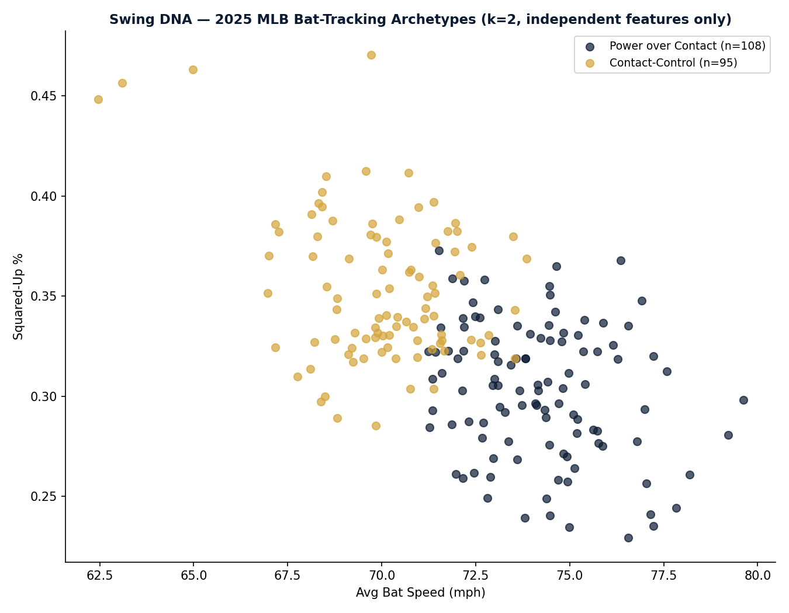

# EP Swing DNA — Swing Archetype Clustering

**Author:** Emerson Jimenez — Emerson Performance (EP)
**Part of the EP-TSP research series**

## Overview

Clusters MLB batters into swing archetypes using real Statcast bat-tracking
data (bat speed, squared-up%, swing length, whiff rate), labels each
archetype using the EP-TSP hitting framework, and validates that the
archetypes correspond to real differences in production (wOBA) — confirmed
independently in two separate seasons (2024, 2025) — not just swing shape.
Includes a player lookup that returns archetype + closest swing comps
league-wide.

**Headline finding**: MLB batters split into two swing archetypes —
**Power over Contact** (higher bat speed, lower squared-up rate) and
**Contact-Control** (lower bat speed, higher squared-up rate) — and this
split corresponds to a real, statistically significant wOBA gap in both
2024 (F=5.15, p=0.024) and 2025 (F=6.27, p=0.013). This independently
corroborates the bat-speed-as-dominant-predictor finding from
`ep-swing-intelligence` (r=0.74 vs. squared-up% r=-0.46), using an
unsupervised method and a different data source (bat-tracking leaderboards
vs. individual Statcast pulls).



### The archetypes in action — 2025 season (true top 5 by wOBA per archetype)

**Power over Contact:**

| Player | Bat Speed | Squared-Up% | wOBA |
|---|---|---|---|
| Nick Kurtz | 78.2 mph | 26.1% | .419 |
| Shohei Ohtani | 74.6 mph | 36.5% | .418 |
| George Springer | 73.0 mph | 30.9% | .408 |
| Ronald Acuña Jr. | 75.9 mph | 27.5% | .403 |
| Cal Raleigh | 75.0 mph | 23.5% | .392 |

**Contact-Control:**

| Player | Bat Speed | Squared-Up% | wOBA |
|---|---|---|---|
| Jonathan Aranda | 70.2 mph | 35.4% | .381 |
| Freddie Freeman | 70.2 mph | 33.1% | .370 |
| Geraldo Perdomo | 67.2 mph | 38.6% | .370 |
| Michael Busch | 68.7 mph | 38.8% | .369 |
| Max Muncy | 71.4 mph | 35.2% | .366 |

**League extremes (2025):** Junior Caminero has the fastest average bat
speed in MLB (79.6 mph). Mookie Betts has the best squared-up rate in MLB
(47.0%) — the two ends of the tradeoff this project measures.

## Data Limitations (read before using or publishing)

1. **Bat-tracking data is not wrapped by `pybaseball`** (confirmed as of
   pybaseball 2.2.7). This project fetches it directly from Baseball
   Savant's CSV leaderboard endpoint
   (`baseballsavant.mlb.com/leaderboard/bat-tracking`).
2. **MLB Advanced Media's Terms of Use prohibit redistribution.** Per
   mlb.com/tou (last updated March 11, 2025): *"you must not reproduce,
   prepare derivative works based upon, distribute, perform or display
   the MLB Digital Properties without first obtaining the written
   permission of MLB."* Baseball Savant is an MLB Digital Property.
   **Practical consequence: the full leaderboard CSV
   (`swing_dna_full_league.csv`) must stay private/local — do not publish
   it to GitHub.** Publishing the methodology, charts, and specific cited
   findings (with attribution) is normal sabermetric practice and the
   recommended path here — same posture already applied to FanGraphs WAR
   data in other EP-TSP repos.
3. **Requires a live-internet environment.** Baseball Savant is not
   reachable from network-restricted sandboxes; run this in Colab or
   locally with real internet access.
4. **The automated year-parameterized fetch is reliable for the current
   season only.** Baseball Savant's raw CSV endpoint does not reliably
   return historical-season data when called with `requests.get()` and a
   `year` parameter — it can silently return current-season data instead
   (most likely due to CDN/edge caching that ignores the query string, or
   a session requirement for historical years that a plain HTTP request
   doesn't satisfy). **For any season other than the current one, download
   the CSV manually from Baseball Savant's UI** (select the year in the
   dropdown, then export), rather than relying on the `year` parameter
   shown in the fetch function. The 2024 vs. 2025 comparison reported
   above was built this way — both years downloaded manually and verified
   independently.
5. **Clustering only reflects swing mechanics unless validated against
   outcomes.** This is why the notebook includes an ANOVA test comparing
   wOBA across archetypes — if that test is not significant (p >= 0.05)
   for a given season/dataset, the archetypes should not be presented as
   scouting-relevant until re-checked.
6. **Two of the five candidate bat-tracking metrics are composite, not
   independent.** `hard_swing_rate` and `blast_per_bat_contact` are
   derived directly from `avg_bat_speed` and `squared_up_per_bat_contact`
   (Statcast defines "hard swing" as bat speed >=75mph, and "blast" as
   squared-up + hard swing combined; confirmed via correlation:
   `hard_swing_rate` r=0.94 with bat speed, `blast_per_bat_contact`
   r=0.82). Clustering uses only the independent subset — avg_bat_speed,
   squared_up_per_bat_contact, swing_length, whiff_per_swing — to avoid
   triple-weighting the bat-speed axis.

## Method

1. Fetch the bat-tracking leaderboard (avg_bat_speed,
   squared_up_per_bat_contact, swing_length, whiff_per_swing, plus the
   composite metrics for display only) and the expected-statistics
   leaderboard (wOBA/xwOBA) for a season, both from Baseball Savant.
2. Merge on player ID.
3. Standardize the independent features and run K-means. **The number of
   clusters (k) is auto-selected via silhouette score** across a candidate
   range (2-7), rather than fixed by assumption. k=2 is the best-supported
   split in both seasons tested.
4. Auto-label each cluster archetype from its centroid's position on the
   two EP-TSP hitting axes (bat speed, squared-up%) — not hardcoded per
   cluster number, so it generalizes across seasons/k values.
5. **Validate**: run a one-way ANOVA on wOBA across archetypes. Report the
   F-statistic and p-value. This is the check for whether the clusters are
   competitively meaningful or just describe swing shape. Confirmed
   significant in two independent seasons (see headline finding above).
6. **Sanity-check against a naive baseline**: compare the multivariate
   clustering against a simple median-bat-speed split. 88% agreement — the
   clustering is not redundant with bat speed alone, but bat speed remains
   the dominant axis (consistent with `ep-swing-intelligence`). The ~12% of
   players reclassified by the multivariate model include cases that match
   known scouting profiles (e.g., a low-whiff, high-squared-up hitter with
   average bat speed correctly grouped as Contact-Control rather than
   Power over Contact under a bat-speed-only split).
7. Visualize archetypes on the bat-speed vs. squared-up% plane (EP brand
   colors).
8. Player lookup: given a partial name match, report the player's
   archetype and 5 nearest swing comps league-wide (Euclidean distance on
   the independent feature set).

## Repo Structure (once run and organized)

```
swing-dna-clustering/
├── Swing_DNA_Clustering.ipynb   # run in Colab or locally with internet
├── README.md
└── outputs/                     # local only — do NOT commit the full league CSV
    ├── swing_dna_clusters.png   # OK to publish
    └── swing_dna_comps_<player>.csv  # small, single-player extract — lower risk than full leaderboard
```

## Requirements

- Python 3.9+, run in an environment with real internet access (Colab recommended)
- `pandas`, `requests`, `scikit-learn`, `matplotlib`, `scipy`

## Known Limitations / Next Steps

- **Single-season snapshots, not a career-level model.** Each year's
  clustering is fit independently; this shows the pattern replicates
  across two seasons, but does not yet test whether a model trained on
  one season predicts archetype/outcome correctly out-of-sample on
  another season.
- **Role/position confound not controlled.** The "Power over Contact"
  archetype likely overrepresents players at positions selected for power
  (1B/DH/corner outfield). The wOBA gap may partly reflect roster
  construction rather than swing mechanics alone. Controlling for position
  is a natural next step before treating this as a causal claim.
- This is a natural extension of `ep-swing-intelligence` (same
  bat-speed/squared-up% axes, same tradeoff finding) rather than a fully
  separate project — consider cross-referencing findings in that repo's
  README.

---
*Native Spanish speaker; basic English (reading/writing). Technical outputs
produced in English per EP portfolio standards.*
